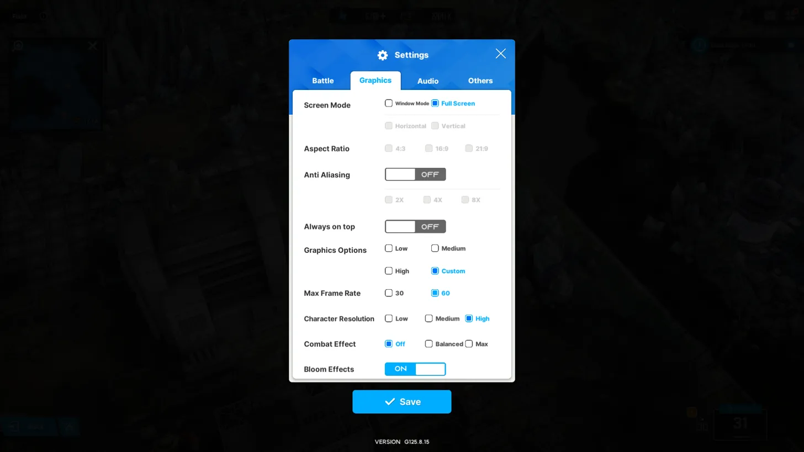
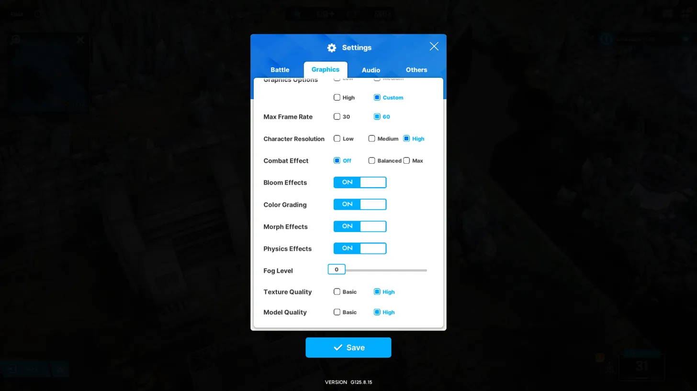
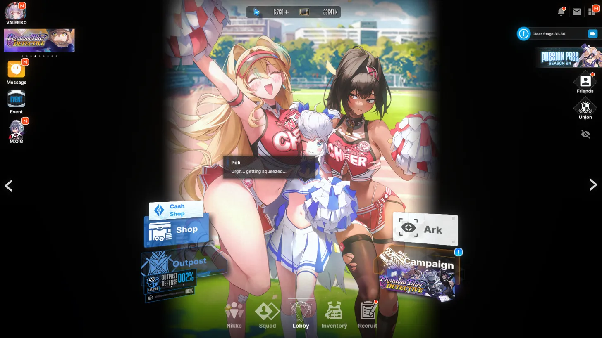

# NIKKE OCR

NIKKE OCR is a non-invasive tool designed to capture and record character information from the mobile game NIKKE: Goddess of Victory. This program uses optical character recognition (OCR) technology to extract data from screenshots of the game, ensuring no interference with the game's files or processes.

## Overview

- Automates the scanning of NIKKE characters
- Extracts character attributes including name, rarity, element, weapon type, squad, burst type, and combat power
- Stores character information in a local database
- Provides a user-friendly interface with real-time logging
- Supports multiple languages (currently English and Spanish)

## System Requirements

- Windows PC (64-bit)
- NIKKE: Goddess of Victory game installed (via emulator or official PC client)
- 1920x1080 resolution display

## Setup and Configuration

1. **Game Settings:**
   - Set NIKKE to run in fullscreen mode at 1920x1080 resolution.
   - Navigate to the character inventory screen in NIKKE.
   - Set your game's language to English for optimal OCR performance.

2. **Recommended In-Game Configuration:**
   Adjust your in-game graphics settings as shown in the provided images below for best results:

   
   

3. **Program Setup:**
   - Extract the NIKKE OCR program to your preferred location.
   - Run `NIKKE-OCR.exe` as administrator.

## How It Works

NIKKE OCR operates by taking screenshots of your game window. It does not interact directly with the game files or processes, ensuring the safety and integrity of your game installation. The program analyzes these screenshots using OCR technology to extract character data.

## Usage Instructions

1. Launch the NIKKE OCR program.
2. In the main window, select the rarities (SSR, SR, R) you wish to scan.
3. Open NIKKE and navigate to the character inventory screen (see the image below for reference):

   

4. Press F1 to initiate the scanning process.
5. The program will automatically capture screenshots and process character data.
6. Character information will be logged in real-time and stored in the local database.
7. To stop the process, press F1 again. Note that it may take a few seconds to complete the current action.

## Important Notes

- Ensure your PC's display scaling is set to 100% for accurate results.
- Keep the NIKKE game window unobstructed during scanning.
- The scanning process will automatically stop after cycling through all characters once.
- Extracted data is saved in JSON format in the `output` folder.

## Troubleshooting

If you encounter issues with character recognition:

1. Verify that your game is running in fullscreen at 1920x1080 resolution.
2. Check that your in-game settings match the recommended configuration (Image 1 and 2).
3. Ensure your game's language is set to English.
4. Restart both the game and the NIKKE OCR program.

## Support

For bug reports or feature requests, please open an issue on the project's GitHub repository or contact the developer directly.

## Privacy and Security

NIKKE OCR is designed with user privacy and game integrity in mind. It only captures and processes visual data from your screen and does not access, modify, or interact with any game files or processes. This ensures that using NIKKE OCR does not violate the game's terms of service or compromise your account security.

## Disclaimer

This tool is fan-made and not officially affiliated with Shift Up or NIKKE: Goddess of Victory. Use at your own discretion. The developers of NIKKE OCR are not responsible for any consequences that may arise from the use of this tool.
